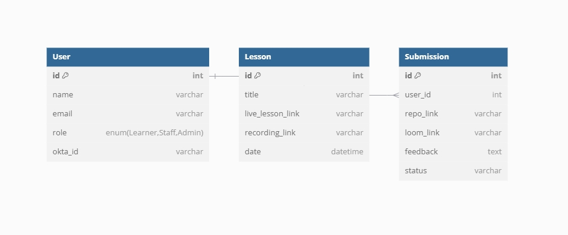

# Spike Project - AI LMS

## High-Level Architecture:
- Backend: Flask (Python)
- Frontend: Vite + React (JavaScript) with TailwindCSS for styling.
- Database: SQLite
- Authentication: Okta for user management (roles: Learner, Staff, Admin).
- Features:
  - Learners can submit a capstone project.
  - Admin can manage learners, submissions, and add video lessons/recordings.
  - Staff can review and update submissions.
  - Dashboard for course progress.

## Backend (Flask):
1. Project Models (SQLAlchemy)
- User: Represents a learner, staff, or admin.
- Lesson: Stores live lesson links, lesson videos, and recordings.
- Submission: Stores learner's capstone project link and Loom video link.
2. Routes:
- Authentication: Okta OAuth.
- Role-based access control: Learner, Staff, Admin.
- CRUD for Lessons, Submissions.

## Frontend (Vite + React):
- UI Components:
  - Course Progress Dashboard: Lists lessons with links and submission status.
  - Admin Panel: Manages learners and submissions.
  - Submission Form: For learners to submit project repository and Loom video.

## Database

